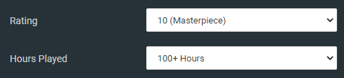
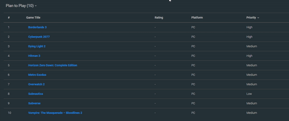
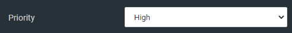
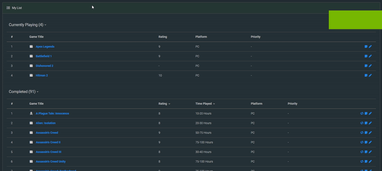
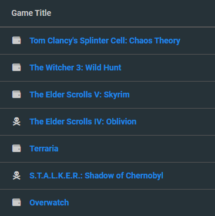
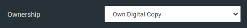

  <h1>MyVideoGameList Advanced</h1>
  
Some code to improve default look and posibilities of <a href='https://myvideogamelist.com/'>myvideogamelist.com</a>

### Main features:

- Dark theme
- Sort your games by rating/hours
- Sort your wishlist by priority
- Hide/show games by category
- New icons
- Fixed issues of original website

## Sort your games by rating/hours

:heavy_exclamation_mark: Sorting works only in "Completed" category. You need to score your games rating and played hours manually. Otherwise script just don't know what data to collect and what to sort. 

To do that, go on game page and select rating and time from these fields and than save it. Games without this data will not be sorted.

Also I made color sorting, which you can notice near title. It is based on rating and is similar to Metacritic color system (green, yellow and red)

* 10-9 - Excelent games (green)
* 8-7 - Good games (yellow)
* <6 - "Meh" (red)

## Sort your wishlist by priority

Just like in case above, you need to set priority on game page in this field and than save it.

And I used color system here too:

* High priority or "Want to play ASAP" (green)
* Medium priority or "Will be good to play someday" (yellow)
* Low priority "<i>Probably</i> will play" (red)

At least, this is how I see this priority system. :wink: It is not perfect, but it's best I can do for now based on website posibilities. 

## Hide/show games by category

You can hide game categories in spoiler if list is too long. Just click on category name.

## New icons

I've noticed that some icons are missing on original website. One of them is ownership indicator. Now it will look like this:

For this icons to appear you need to set and save this field in game page:

## How to use it?

1) Install [User JavaScript and CSS](https://chrome.google.com/webstore/detail/user-javascript-and-css/nbhcbdghjpllgmfilhnhkllmkecfmpld) (available for Chrome only)
2) Insert code from [main.js](main.js) and [style.css](style.css) in plugin (make sure to prioritize CSS in plugin options)
3) And that's it!

P.S.: you may try run it on another browser, for example Firefox has similar plugin names [Modus](https://addons.mozilla.org/ru/firefox/addon/modus-css-js/?src=search).

## Known issues:

* ~~When user haven't scored game rating and played hours, script don't work at all~~
* ~~Hide/show games by category don't work if user don't have any "Plan to play" games~~

## To-do list

* Analyze and correct design issues caused by dark theme
* Store hidden categories in localStorage
* Add placeholder or icon when ownership status isn't set at all
